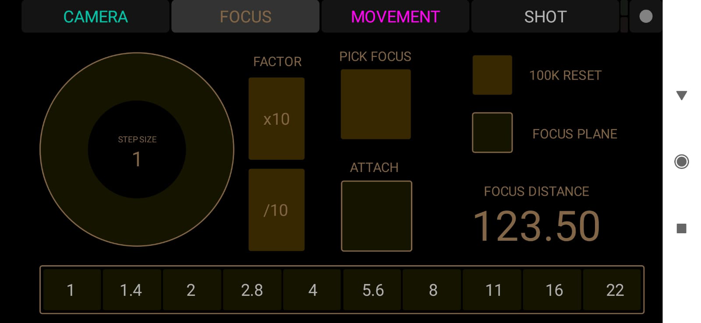
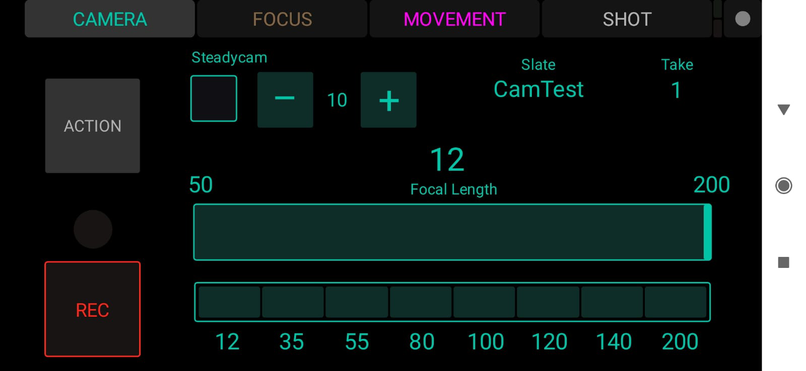
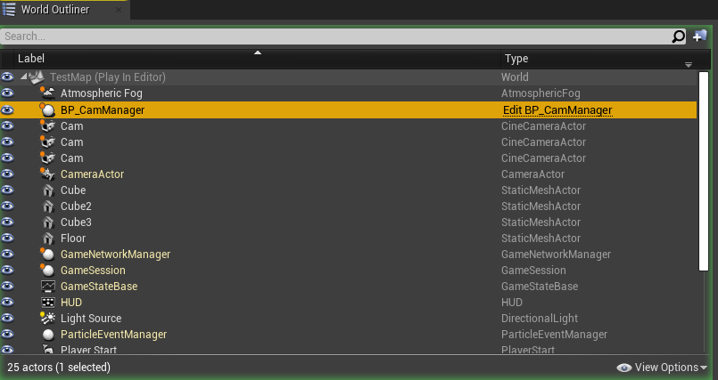
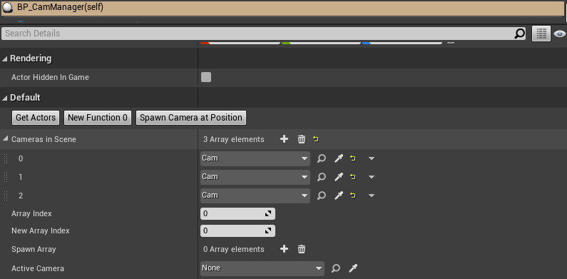
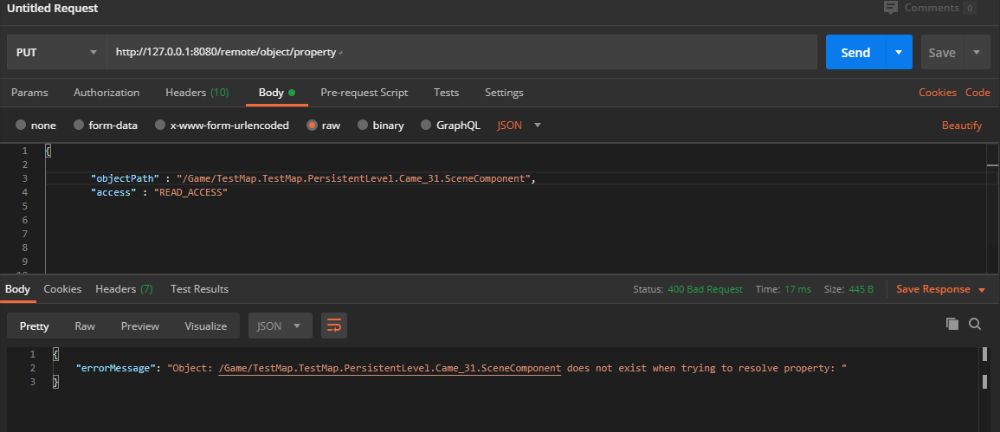
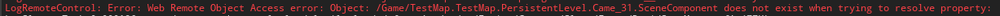
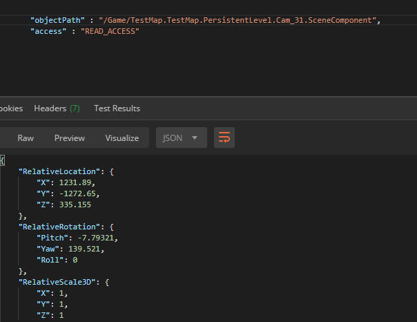

## Main Concept

 _Creating a virtual production tool in form of an web application_

 **Main Purpose**

 _The app should be able to swtich between cameras inside an unreal engine scene and be able to change the focal length,  focus and transformation of each camera_

**Worst Case**

* ability to set and get properties from objects inside Unreal 
* **Layoutsystem** - the user should be able to switch between different layouts
* Page with hardcoded components to get and set events
* Showcase of a Prototype 


**Best Case**

* ability to set and get properties and call functions from objects inside Unreal
  
* **Layoutsystem** - the user should be able to switch between different layouts
* **Addable components**
  * give user ability to add different components to the app

* **Usable in Production**
---

## 19/01/21

_finalized the main purpose of the app and reworked Use Case Diagramm and Component Diagram_

* The app should be able to swtich between cameras inside an unreal engine scene and be able to change the focal length,  focus and transformation of each camera


**Use Case Diagram**


_Sequence diagram._

* the User should be able to switch between the different pages on the app
* the User should be able to select different cameras inside the Unreal Engine scene over the app
* the User should be able to change the Focal Length of the selected Camera
* the User should be able to change the Focus of the selected Camera
* the User should be able to change the Transformation of the selected Camera
* the User should be able to switch beween Play and Edit on a Page
* the User should be able to set a Layout
* the User should be able to add a Tab
* the User should be able to Delete a Tab
* the User should be able to Rename a Tab
* the User should be able to add Components
* the User should be able to delete Components


_Component diagram._

---

## 21/01/21

_Researched other possible applications to set/get properties and call functions in Unreal Engine over another device to get an idea what components I would need to modify the Cameras_


**Touch OSC**

Touch OSC is a touchscreen MIDI and OSC controll app. It provides a veriety of control shapes & styles, and it is easy to configure each to fit specific preferences. 


_OSC Focus Page._


_OSC Camera Page._

I created a layout for different camera settings and connected the **Touch OSC** with an Unreal Engine scene with a provided Plugin to drive a virtual Camera.

**Touch OSC** is very useful if you have to set something up quickly. No coding is required because of the construction kit  but you are however very limited to only the components it provides, the simple style, limited tabs and functions. 


---

## 23/01/21
_Starting to create App with Vue.js_

* implementing Navigation


## 26/01/21

_reworked the app design and created an Unreal Scene for testing and setting up functions_


_Event-Page Edit mode._


_Event-Page Play mode._


_Camera Page mode._

* as components i decided to have a dial knob for changing the focus, a slider to change the focal length and joysticks for changing the transformation (ideas from Touch OSC)

 **Unreal Engine Scene**

 For testing I placed Cameras inside the scene and created a Blueprint called **CameraManager**. The CameraManager provides different functions to manage the Cameras inside the Scene and which provides all information and functions that are called by the web application as a client.

 


* On Play the CameraManager gets all Cameras inside the Scene and saves them inside an array.


 


* Set View Function selectes a Camera which will then be the viewport of the scene.

* Spawn Camera Function spawns a Camera on position of Viewport

---

## 02/02/021

_Testing communication with Web server on the Unreal Engine with Posteman_

* For testing I setted up the server on the created Unreal Project and used Posteman to write requests to see if I get correct responses from the serve and if I can call Functions and set or get Properties.



_Postman unsuccessful request._


---



_Errorlog from Unreal._

---


_Postman successful request._


---

##  05/02/021

_creating javascript file that communicates with Unreal Engine server_

* using axios to communicate with server
* setting up get/set and call function method with correct requestbody to send to the server

_call Function_

```javascript
 let requestBody = {
      "ObjectPath": objectPath,
      "FunctionName": functionName,
      "Parameters": parameters,
      "GenerateTransaction": generateTransaction
    };
```

_set Property_

```javascript
  let requestBody = {
      "ObjectPath": objectPath,
      "PropertyName": propertyName,
      "PropertyValue": value,
      "Access": "WRITE_TRANSACTION_ACCESS"
    };
```

_get Property_

```javascript
  let requestBody = {
      "ObjectPath": objectPath,
      "PropertyName": propertyName,
      "Access": "READ_ACCESS"
    };
```
_Succesfull_

**(PROBLEM)**

* Realising that I haven't thought about the problem that Unreal Engine doesn't save any changes while beeing in game state.
  - Have to find solution


---


## 09/02/21

_Trying to find out how to keep changes inside Game State_

* checking out Multi User unsucessful (Multi User has to be in same State to see changes)

* checking Forums (unsuccessful)

* writing in Forum (waiting for response)

---

## 11/02/21

_Creating Components_

Implemented Function that creates Tabs for each Camera inside Unreal Engine scene


For the dial knob I used the [**vue-knober**](https://github.com/shiasn/vue-knober) by [shiasn](https://github.com/shiasn)
and changed it into a dial knob.


For the slider I used the [**vue-range-slider**](https://github.com/ktsn/vue-range-slider) by [ktsn](https://github.com/ktsn)
and and modified it.

GIF

- no progress in solving the game state issue
- no response in Forum

---

## 12/02/21

_Testing Components_

* Trying out if Components can set Properties inside the Unreal Engine scene

* Saving the path of each Camera Tab to drive only properties of selected Camera Tab


* Created Check Box component with Vue.js


* Created Dropdown component with Vue.js


_Succesful_

* Response in Forum - Idea: write an own C++ Blueprint node that spawns a Camera in Editor World.

---

## 16/02/21

_Learning how to creat C++ Blueprint Nodes_

* Created a simple Blueprint
* Trying to find out how to spawn something in Editor

_Created Joystick Component_

For the Joystick I used [**nipplejs**](https://github.com/yoannmoinet/nipplejs) by [yoannmoinet](https://github.com/yoannmoinet).


## 17/02/21

_Created Blueprint Node that spawns in Editor World_

!YAY it works

**(PROBLEM*)**
Realsing that this won't solve my problem... because if I want to change now the the spawned Camera or any other Camera that is already in the Scene I would have to spawn a Camera inside the Editor each time I change something so that the changes a kept which is very unefficent - have to find other solution

---

## 18/02/21

_Tried Collab Viewer Template from Unreal and Multi User to see if I can fix the game state issue_

* No progress so far

---

## 21/02/21

_Further tried Collab Viewer Template  and Multi User from Unreal to see if I can fix the game state issue_

* Found a way to make it work with Multi User by starting the Unreal Project with a terminal as an unpackaged game which still connects to the Multi User server and sees the changes that are made by someone else who is in edit state.

With that solution I can now change everything with the App in the editor and call functions which will be seen from the other multi user client who is in the game state while all the changes are beeing kept because they are made in the editor.

Finally solved this issue!!!!!!

---

## 29/02/21

_Fixing bug,reuqest and response errors and worked a bit on styling_

* Fixed a few Network errors
* Styling the app

---

## 02/02/21

_Working on the layout page_

* Researching how to change classes dynamicly in Vue.
* Setting up a layout


---

## 04/02/21

_Implementing connection with websockets._

* I tried to implement communication with the web server through web sockets. 

* _set and call function_ works but _getfunction_ is not, because I am trying to access the value inside the response before it arrives

No clue how to solve this effeciently

---

## 05/02/21

_Finished the layout system._

* Layout can now be changed into 1x1 1x2 2x1 2x2  
---

## 09/02/21

_Further implementation_

Trying to find a solution how to add components into the panels while in edit mode 
- unsuccesful

## 11/02/21

_Creating a new app with only the core functions for assignment_

* Because of creating the app partly during work at OnPoint Studio this App belongs to OnPoint. Therefore I have to reduce it to only it's core functions which will show how to set, get and call a Function inside an Unreal Engine scene aswell as the implemented layout page. A video will show how the protoype for the Camera Application works.


  **Video can be found inside assets/video**

  - WebApp.mp4

